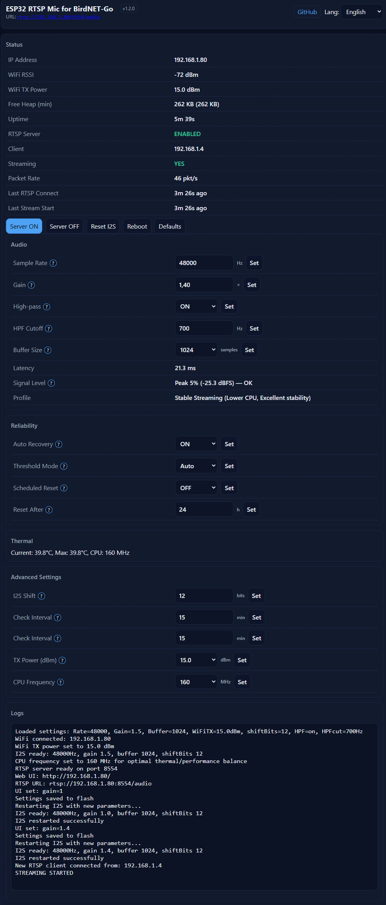

  

# ESP32 RTSP Mic for BirdNET-Go

ESP32-C6 + I2S MEMS microphone streamer that exposes a **mono 16-bit PCM** audio stream over
**RTSP**, designed as a simple network mic for **BirdNET-Go**.

- Latest firmware: **v1.4.0** (2026-02-09)
- Target firmware: `esp32_rtsp_mic_birdnetgo` (Web UI + JSON API)
- Changelog: `esp32_rtsp_mic_birdnetgo/CHANGELOG.md`
- One-click web flasher (recommended): **https://esp32mic.msmeteo.cz**
  (Chrome/Edge desktop, USB-C *data* cable)

## Quick Start (EN)

1. Open **https://esp32mic.msmeteo.cz**.
2. Click **Connect**, select the USB JTAG/serial device, wait for reboot.
3. On first boot the device starts AP **ESP32-RTSP-Mic-AP** (open).
   Connect and finish Wi-Fi setup at `192.168.4.1` (captive portal).
4. Open the Web UI: `http://<device-ip>/` (port **80**).
5. RTSP stream (BirdNET-Go/VLC/ffplay):
   `rtsp://<device-ip>:8554/audio` (or `rtsp://esp32mic.local:8554/audio` if mDNS is enabled).

<strong>Rychlý start (CZ)</strong>

1. Otevři **https://esp32mic.msmeteo.cz**.
2. Klikni na **Flash**, vyber USB JTAG/serial zařízení a počkej na reboot.
3. Po prvním startu se objeví AP **ESP32-RTSP-Mic-AP** (bez hesla).
   Připoj se a dokonči nastavení Wi-Fi na `192.168.4.1` (captive portal).
4. Web UI: `http://<device-ip>/` (port **80**).
5. RTSP stream: `rtsp://<device-ip>:8554/audio`
   (nebo `rtsp://esp32mic.local:8554/audio`, pokud máš zapnuté mDNS).

## Wiring (XIAO ESP32-C6 + ICS-43434)

| ICS-43434 signal | XIAO ESP32-C6 GPIO | Notes |
|---|:--:|---|
| **BCLK / SCK** | **21** | I2S bit clock |
| **LRCLK / WS** | **1** | I2S word select |
| **SD (DOUT)** | **2** | I2S data out from mic |
| **VDD** | 3V3 | Power |
| **GND** | GND | Ground |

Tips:
- Keep I2S wires short; for longer runs use shielded cable to reduce EMI.
- Some XIAO ESP32-C6 revisions use an RF switch (GPIO3/GPIO14). If you use a different board or
  internal antenna only, you may need to comment out the antenna GPIO block in `setup()`.

## Test The RTSP Audio

- VLC: *Media* → *Open Network Stream* → paste the RTSP URL.
- ffplay:
  `ffplay -rtsp_transport tcp rtsp://<device-ip>:8554/audio`
- ffprobe:
  `ffprobe -rtsp_transport tcp rtsp://<device-ip>:8554/audio`

If VLC/ffplay works, BirdNET-Go will typically work too (just use the same RTSP URL as your input).

## Highlights (v1.4.0)

- Web UI (EN/CZ) on port **80** with live status, logs, and controls
- JSON API for automation
- Auto-recovery (manual/auto packet-rate thresholds)
- Scheduled reset, CPU frequency control
- Thermal protection with latch + acknowledge
- High-pass filter (HPF) configurable (reduce rumble)
- RTSP keep-alive (`GET_PARAMETER`), single client

Web UI screenshot:

## Recommended Hardware (TL;DR)

| Part | Qty | Notes | Link |
|---|---:|---|---|
| Seeed Studio XIAO ESP32-C6 | 1 | Target board (tested) | [AliExpress](https://www.aliexpress.com/item/1005007341738903.html) |
| MEMS I2S microphone **ICS-43434** | 1 | Supported/tested reference mic | [AliExpress](https://www.aliexpress.com/item/1005008956861273.html) |
| Shielded cable (6 core) | optional | Helps reduce EMI on mic runs | [AliExpress](https://www.aliexpress.com/item/1005002586286399.html) |
| 220 V -> 5 V power supply | 1 | >= 1 A recommended for stability | [AliExpress](https://www.aliexpress.com/item/1005002624537795.html) |
| 2.4 GHz antenna (IPEX/U.FL) | optional | If your board/revision uses external antenna | [AliExpress](https://www.aliexpress.com/item/1005008490414283.html) |

Notes:
- Links are provided for convenience and may change over time. Always verify the exact part number
  (for example **ICS-43434**) in the listing before buying.

## Tips & Best Practices

- RTSP is **single-client** (only one connection at a time).
- Wi-Fi: aim for RSSI > -75 dBm; try buffer >= 512 for stability.
- Placement: keep the mic away from fans/EMI; shielded cable helps for longer runs.
- Security: keep the device on a trusted LAN; do not expose HTTP/RTSP to the public internet.

### High-Pass Filter (Reduce Low-Frequency Rumble)

- Default: ON at 500 Hz (v1.4.0).
- Typical cutoff range: 300-800 Hz depending on your environment.
- UI: Web UI -> Audio -> `High-pass` + `HPF Cutoff`.
- API:
  - Enable/disable: `GET /api/set?key=hp_enable&value=on|off`
  - Set cutoff (Hz): `GET /api/set?key=hp_cutoff&value=600`

## Compatibility

- **Target board:** ESP32-C6 (tested with Seeed XIAO ESP32-C6).
- Other ESP32 variants may work with pin/I2S tweaks.
- Other I2S mics may be possible, but **ICS-43434** is the supported/tested reference.

## More Docs (Build, API, Internals)

See `esp32_rtsp_mic_birdnetgo/README.md`.
